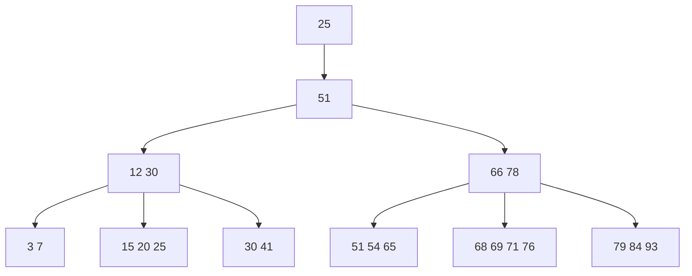

# SQL 实体完整性

## 定义实体完整性

关系模型的实体完整性在CREATE TABLE中用PRIMARY KEY定义,对单属性构成的码有两种说明方法,一种是定义列级约束条件,另一种是定义为表级约束条件,对多个属性构成的码只有一种说明方法,即定义为表级约束条件

**[例5.1]**:将Student表中的Sno属性定义为码

```sql
CREATE  TABLE [S-T].Student--将Student表中的Sno属性定义为码
         (
             Sno CHAR(9) PRIMARY KEY ,--在列级定义主码
             Sname CHAR(20)NOT NULL ,
             Ssex CHAR(2),
             Sage SMALLINT,
             Sdept CHAR(20)
         );
```

或者

```sql
CREATE  TABLE [S-T].Student--将Student表中的Sno属性定义为码
         (
             Sno CHAR(9) ,
             Sname CHAR(20)NOT NULL ,
             Ssex CHAR(2),
             Sage SMALLINT,
             Sdept CHAR(20)
             PRIMARY KEY (Sno)--在表级定义主码
         );
```

**[例5.2]**:将SC表中的Sno,Cno属性组定义为码

```sql
CREATE TABLE SC
         (
             Sno CHAR(9)NOT NULL ,
             Cno CHAR(4)NOT NULL ,
             Grade SMALLINT,
             PRIMARY KEY (Sno,Cno)--只能在表级定义主码

)
```

## 实体完整性检查和违约处理

- 用PRIMARY KEY短语定义了关系的主码后,每当用户程序对基本表插入一条记录或对主码列进行更新操作时,关系数据库管理系统将按照实体完整性规则自动进行检查,包括:
    - 查主码值是否唯一,如果不唯一则拒绝插入或修改
    - 检查主码的各个属性是否为空,只要有一个为空就拒绝插入或修改
- 检查记录中主码值是否唯一的一种方法就是进行全表扫描,依次判断表中每一条记录的主码值与将插入记录的主码值（或者修改的新主码值）是否相同
- 全表扫描是十分耗时的,为了避免对基本表进行全表扫描,关系数据库管理系统一般都在主码上自动建立一个索引,如B+树索引,同通过索引查找基本表中是否已经存在新的主码值将大大提高效率,例如,如果新插入记录的主码值是25,通过主码索引,从B+树的根结点开始查找,只要读取3个节点就可以知道该主码值已经存在,所以不能插入这条记录,这3个节点是根节点(51),中间结点(12 30)和叶节点(15 20 25),如果新插入记录的主码值是86,也只要查找3个基点就可以知道主码值不存在,所以可以插入该记录



