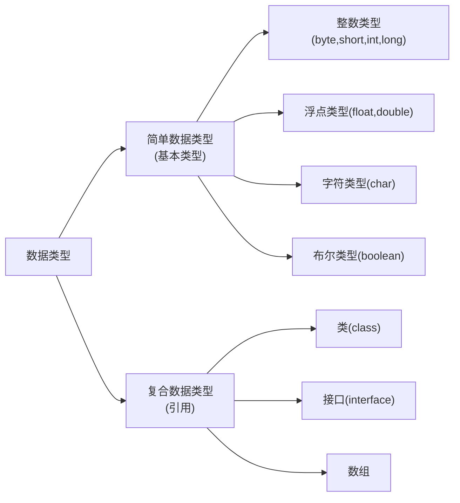

#  Java 数据类型与变量

## 数据类型

在程序设计中要使用和处理各种数据,数据按其表示信息的含义和占用空间大小分为不同类型,Java语言的数据类型可以分为简单数据类型和复合数据类型两大类如下图所示:



- 简单数据类型也称基本类型,它代表的是语言能处理的基本数据,如数值数据中的整数和实数(也叫浮点数),字符类型和代表逻辑值的布尔类型,基本数据类型数据的特点是占用的存储空间是固定的
- 复合数据类型也为引用类型,其数据存储取决于数据类型的定义,通常由多个基本类型或复合类型的数据组合构成
- 数据所占存储空间的大小以字节为单位,下表列出了Java所有基本数据类型分配的存储空间大小及数据取值范围,在某些情况下,系统自动给基本数据类型的存储单元赋默认值,下表中给出了各种基本类型的默认值

| 关键字  | 数据类型     | 所占字节 | 默认值 | 取值范围                  |
| ------- | ------------ | -------- | ------ | ------------------------- |
| byte    | 字节型       | 1        | 0      | -2[^7]~2[^7]-1            |
| short   | 短整型       | 2        | 0      | -2[^15]~2[^15]-1          |
| int     | 整型         | 4        | 0      | -2[^31]~2[^31]-1          |
| long    | 长整型       | 8        | 0      | -2[^63]~2[^63]-1          |
| float   | 单精度浮点型 | 4        | 0.0F   | 1.4e[^-45]~3.4e[^+038]    |
| double  | 双精度浮点型 | 8        | 0.0D   | 4.9e[^-324]~1.798e[^+308] |
| char    | 字符型       | 2        | 0      | 0~65535                   |
| boolean | 布尔型       | 1        | false  | true,false                |

## 常量

常量是指在程序运行过程中其值保持不变的量,没中过基本数据类型均有相应的常量,如布尔常量,整型常量,浮点常量,字符常量等,另外还有一种常量是字符串常量,该类常量的处理有些特殊,原因在于Java并没有将字符串作为简单类型,而是作为一种复合类型对待,在Java中专门有一个类String对应字符串的处理

### 布尔常量

只有true和false两个取值,它表示逻辑的两种状态,true表示真,false表示假,注意:Java中的布尔类型是一个独立的类型,不对应任何整数值,这与C语言的中的布尔值用0或非0来表示是完全不同的

### 整型常量

整型常量就是不带小数的整数,包括负数,在Java中整型常量分为long,int,short和byte4种类型,在Java语言中,对于数值数据的表示又以下4种形式:

- 十进制:数据以非0开头,如4,-15
- 八进制:数据以0开头,其中,每位数字的范围为0-7,如054,012
- 十六进制:数据以0x开头,每位数字的范围为0-9和A-F,如0x11,0xAD00
- 二进制,数据以;0b开头,如0b11

**注意**

Java语言的整型常量默认为int类型,要将一个常量声明为长整型类型 则需在数据的后面加L或1(一般使用L).如12代表一个整型常量,占4个字节,12L代表一个长整型常量,占8个字节

### 浮点常量

浮点常量也称为实数,包括float和double两种类型,浮点常量有以下两种表示形式:

- 小数点形式:也就是以小数表示法来表示实数,如6.37,-0.023

- 指数形式:也称科学表示法,e/E左边的数为底数,右边的数据是10的幂,如3e-2代表0.03,只有实数采用科学表示法,整型常量不能用这种形式

**注意**

为了区分float和double两类常量,可以在常量后面加后缀修饰, float类型常量以F/f结尾,double类型常量以D/d结尾,如果浮点常量不带后缀,则默认为双精度常量

### 字符常量

字符常量是由一对单引号括起来的单个字符或以反斜线"\"开头的转义符,Java的字符编码采用了国际统一标准的Unicode码,一个字符用16位无符号型数据表示:'A'的编码为65,'a'的编码为98,大小写字母相差32

**注意**

表示字符的另一种方法是用转义字符加编码值来表示,具体有以下两种方法:

  转义字符|	描述
  :---:|:---:
  \'|	单引号字符
  \"	|双引号字符
  \\|	反斜杠
  \r|	回车
  \n	|换行
  \f|	走纸换页
  \t|	横向跳格
  \b|	退格

表示字符的另一种方式是用转义字符加编码值来表示,具体有以下两种方法:

- `\ddd`:用1到3为八进制数(ddd)表示字符
- `(u)xxxx`:用一到4位十六进制数(xxxx)表示字符		

### 字符串常量

- 字符串常量是用双引号括起来的由0个或多个字符组成的字符序列,字符串中可以包含转义字符,例如,”12345”,”a”
- Java中,字符串实际上是String类常量,String类在Java中有特殊的地位,编译器能自动把双引号之间的字符识别为String常量

## 变量

### 变量的定义与赋值

在程序中通过变量来保存那些运行可变的数据,Java中的变量必须先声明,后使用,声明变量包括指明变量的类型和变量的名称,根据需要也可以指定变量额初始值,变量定义与赋值的格式为:

> 类型 变量名\[=值][,变量名[=值],...];

**说明**:格式中方括号表示可选部分,其含义是在定义变量时可以设置变量的初始值,如果在同一语句中要声明多个变量,则变量间用逗号分隔,例如:

```java
int count;//定义count为整型变量
double m,n=0;//定义变量m和n为双精度型,同时给变量n赋初值0
char c='a';//定义字符串变量c并给其赋初值
count=0;//给变量count赋值
```

- **说明**:上述给变量赋值的语句称为赋值语句,其效果是将赋值号"="右边的值赋给左边的变量
- 声明变量又称创建变量,执行变量声明语句时系统根据变量额数据类型在内存中开辟相应的内存空间,并将变量的值 存入该空间,可以想象每个变量为一个小盒子,变量名为盒子的标记,而变量的值为盒中的内容
- 在某些情况下,变量没有赋初值时系统将其所属类型给变量赋初值,但是,通常要养成引用变量前保证变量已赋值的习惯
- 变量的命名要符合标识符的规定,每个变量均有一个作用域,在变量的作用域内不能定义两个同名的变量,程序中用变量名来引用变量的数值,在变量作用域外不能再访问该变量,无效变量占用空间也将由系统垃圾回收程序自动将其释放

### 变量的取值范围

变量所分配的存储空间的大小取决与变量的数据类型,不同数值型变量的存储空间大小不同,因此能存储的数值范围也不同各种数值变量对应的包装类中分别定义MAX_VALUE和MIN_VALUE两个属性常量来指示相应基本类型的数值范围

### 赋值与强制类型转换

在程序中经常需要通过赋值运算设置或更改变量的值,赋值语句的格式为:

> 变量=表达式;

- 其功能是先计算右边表达式的值,再将结果赋给左边的变量
- 表达式可以是常数,变量或一个运算式,例如:

```php
int x=5;//将5赋值给变量x
x=x+1;//将x的值增加1重新赋值给x
```

**注意**

- 赋值不同于数学上的"=",x=x+1再数学上不成立,但这里的作用是给变量x的值增加1,程序中常用这样的方式将一个变量的值递增
- 在使用赋值运算时可能会遇到等号左边的数据类型于等号右边的数据类型不一致的情况,这时需要将等号右边的结果转换为左边的而数据类型,再赋值给左边的变量,可能出现以下两种情况:一种是系统自动转换,另一种是必须使用强制转换,Java规定,数据表示范围小的"短数据类型"转换为数据表示范围大的"长数据类型",系统将自动进行转换,反之必须使用强制类型转换
- 以上情况很容易理解,短数据类型的数据转换为长数据类型显然不存在数据超出范围问题,而将长数据类型的数据存储在短数据类型的空间中,则存在存储超出范围的问题,因此,强制转换有可能会造成数据的部分丢失

#### 自动转换

基本数据类型自动转换的递增顺序为:

```java
byte->short->char->int->long->float->double
```

#### 强制类型转换

> 变量 = (数据类型)表达式

**注意**

布尔类型不能与其他类型进行转换

**[例2-1]简单数据类型输出

```java
public class SimpleDataType{
    public static void main(String args[]){
        int i=3;//整常数默认为int型
        byte b = (byte)i;//将int类型转换为byte型要使用强制转换
        short si.=20000;
        int li = (int)4.25;//实数转换为整数
        float f = 3.14f;//实数默认为双精度型,通过后缀指定为float型
        System.out.println(b+"\t"+si+"\t"+i+"\t"+li+"\t"+f);
    }
}

3	20000	3	4	3.14
```

#### 说明

- 第8行实现程序结果的输出,用"+"运算符将输出数据与字符串拼接

- 对于用整数常数给变量赋值,系统将自动检查数据的大小是否超出变量类型的范围,例如,第5行的20000虽然是int类型常数,但其值在short类型有效范围内,因此系统将自动转换赋值,如果数据超出范围,则不能通过编译,例如:

```java
short si=200000;//编译指示将丢失数据精度
```

但要注意,以上指的是赋值号右边为常数情况,如果赋值号右边是变量则严格按照类型转换原则进行检查,如果将第4行改为"byte b = i;",则编译器将提示错误

- 第7行的常数后加f是必要的,不能将双精度数给float变量直接赋值,否则将不能通过编译,也可以使用强制转换

```java
float f =(float)3.14
```

有些情况下,强制转换会导致数据结果的错误,例如:

```java
byte x=25,y=125;
byte m = (byte)(x+y);
System.out.println("m="+m);

m=-106
```

字节数据的最大表示范围是127,再大的数只能进位到符号位,因此,产生的结果为一个负数,如果不使用强制类型转换,直接写成如下形式:
```java
byte m = x+y;
```

编译会给出"possible loss of precision"的错误提示信息

**注意**

为避免数据溢出,Java虚拟机将两短整数相加的结果默认为int类型,因此两整数进行加,乘等运算,如果将结果赋值给长度小于int类型大的变量,编译要求进行强制类型转换,否则不能通过编译


